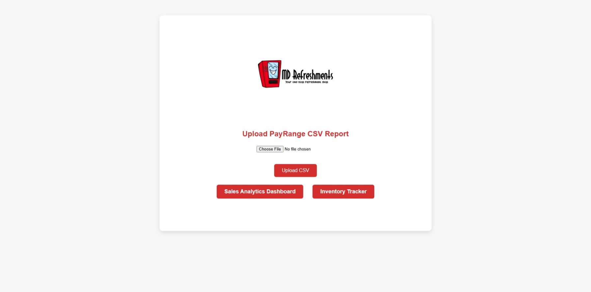
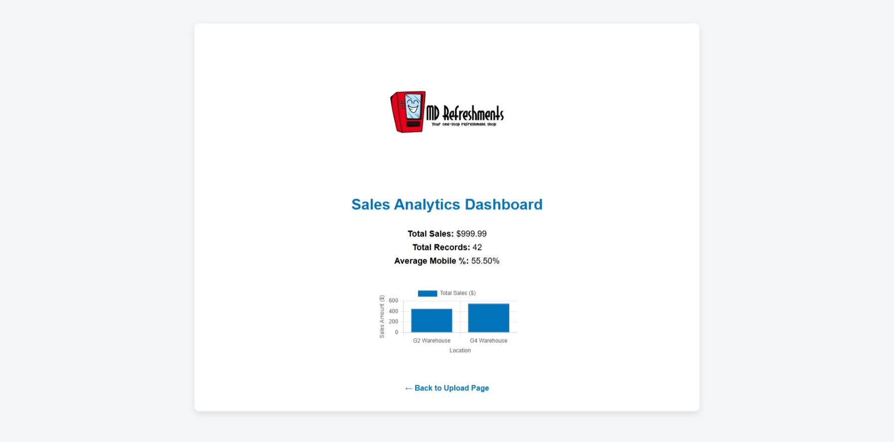
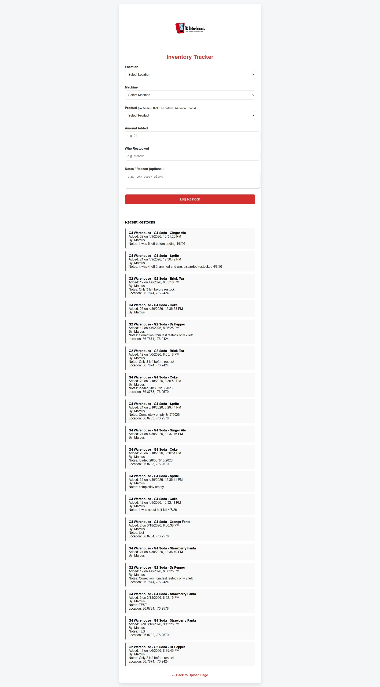

# MD Refreshments Vending Machine Tracker

A fully serverless web application built with AWS to track sales and inventory for my vending machines in the Norfolk area.

## Live Demo
[https://www.mdrefreshmentsfinance.com/](https://www.mdrefreshmentsfinance.com/)

## Screenshots

### 1. Main Upload Page

### 2. Sales Analytics Dashboard

### 3. Inventory Tracker

## Features
- Upload and parse PayRange CSV sales reports
- Sales analytics dashboard with bar chart by location (Chart.js)
- Inventory tracker with GPS timestamp logging and recent restocks
- Clean, mobile-friendly UI with red branding matching my company logo

## Tech Stack
- **Frontend**: HTML, CSS, JavaScript, Chart.js
- **Hosting**: Amazon S3 + CloudFront (HTTPS + custom domain)
- **API**: API Gateway HTTP API
- **Backend**: AWS Lambda (Python 3.11)
- **Database**: Amazon DynamoDB (two tables)

## Architecture Highlights
- Static frontend served from S3 with CloudFront
- API Gateway routes all requests to a single Lambda function
- DynamoDB used for both sales data and inventory logs
- Least-privilege IAM policies and proper CORS configuration

## What I Learned
- Serverless architecture design and deployment
- Handling file uploads and data cleaning in Lambda
- CORS configuration on HTTP API
- Decimal data type handling with DynamoDB
- Client-side geolocation and dynamic dropdown filtering

## Future Improvements
- QR code scanning for machines
- Photo upload with Amazon Rekognition for auto stock detection
- Stock level calculations and low-stock alerts
- Structured error logging

---

Built with ❤️ for my vending business | [Live Site](https://www.mdrefreshmentsfinance.com/)
